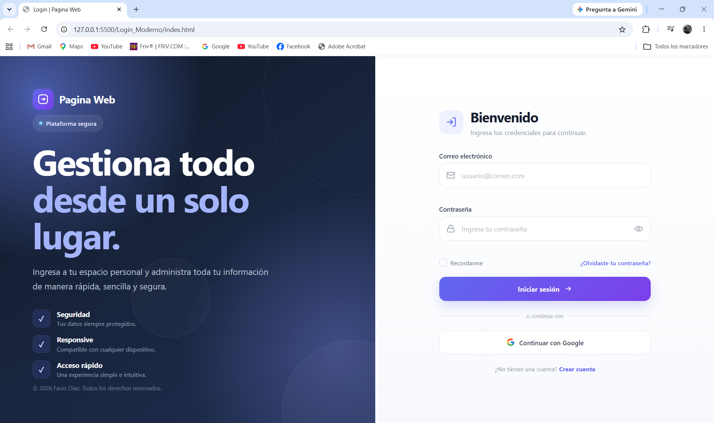
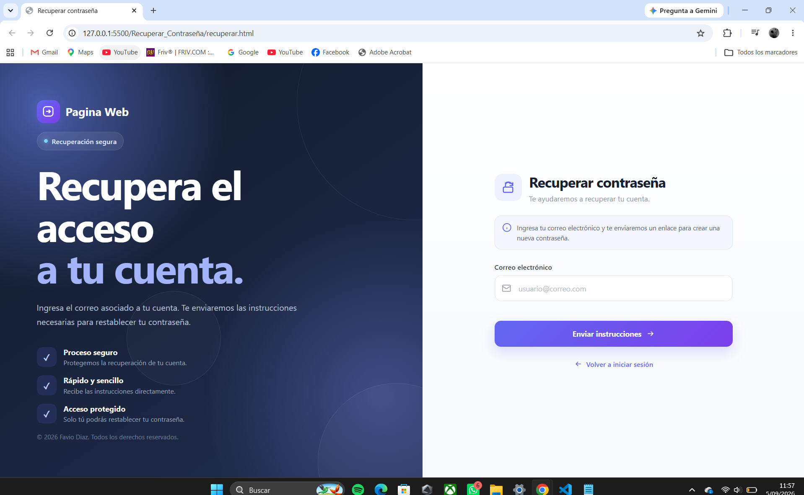
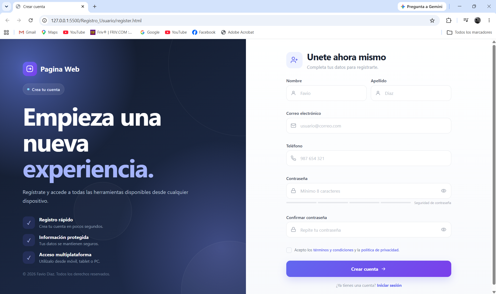
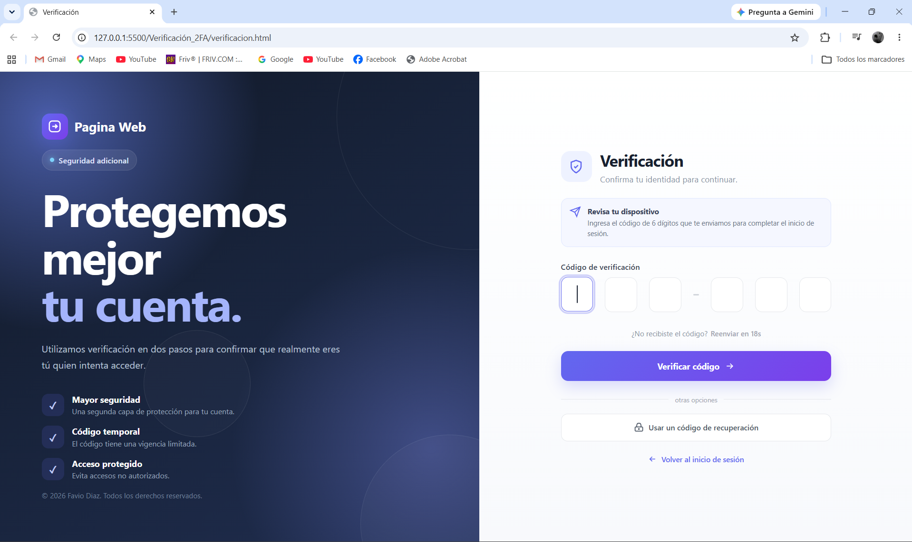

# Portafolio de Interfaces Frontend

¡Hola! Soy Favio Diaz. Este es mi portafolio profesional de desarrollo frontend.

## 🛠️ Tecnologías utilizadas
- Html
- Css
- JavaScript

## 📂 Estructura
Las interfaces están dentro de la carpeta `Interfaz Frontend`:
- **Iniciar sesión_Moderno**: Pantalla de login moderna.
  
 
 
- **Recuperar_Contraseña**: Flujo de recuperación de contraseña.

  
- **Registro_Usuario**: Formulario de registro.

 
  
- **Verificación_2FA**: Autenticación de dos factores.

 

## 📫 Contacto
- **Correo**: faviodiaznapan@gmail.com
